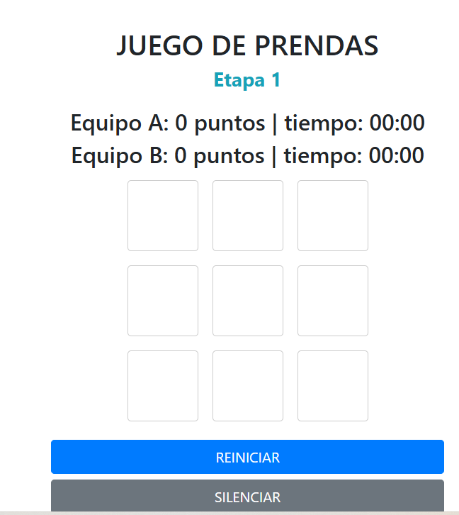
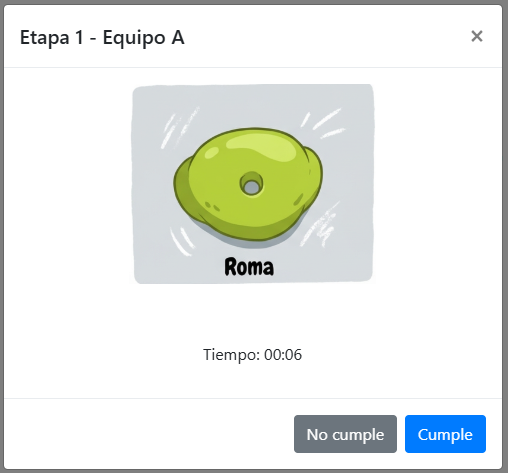
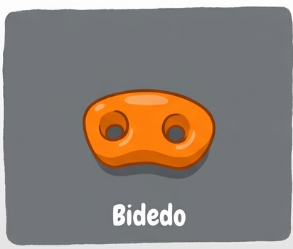
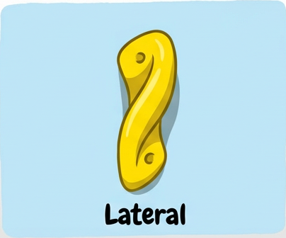
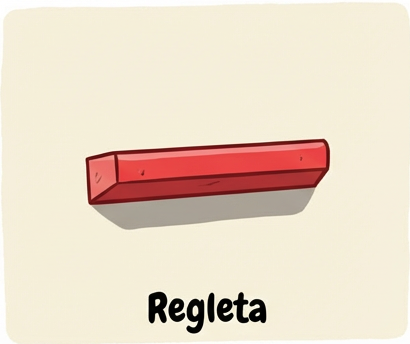
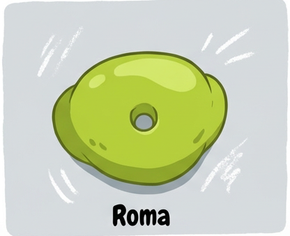
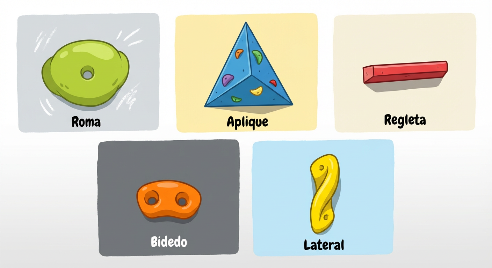

<h1> JUEGO DE ESCALADA PARA INFANTILES </h1>

Se trata de un juego de prendas en el que participan dos equipos, el equipo A y el equipo B. Cada equipo debe completar la prenda en el menor tiempo posible. En pantalla, se van a ir mostrando los puntos y los tiempos, que cada equipo va realizando al completar las prendas.-

En pantalla va a desplegarse una cuadrícula con nueve cuadrados.

Al tocar un cuadrado, se va a mostrar el nombre de una toma que el equipo debe tocar, identificar o incluso ser un top de vía en la palestra.

Estas tomas pueden ser:

<table border="1">
  <tr>
    <td><ul><li>Aplique</li></ul></td>
    <td></td>
  </tr>

  <tr>
    <td><ul><li>Bidedo</li></ul></td>
    <td></td>
  </tr>

  <tr>
    <td><ul><li>Lateral</li></ul></td>
    <td></td>
  </tr>

  <tr>
    <td><ul><li>Regleta</li></ul></td>
    <td></td>
  </tr>

  <tr>
    <td><ul><li>Roma</li></ul></td>
    <td></td>
  </tr>

  <tr>
    <td><ul><li>Comodín</li></ul><spam>(El equipo elige la toma)</spam></td>
    <td></td>
  </tr>

</table>

El juego consta de dos etapas. La primera, cada prenda es una sola toma, Aplique, Roma, etc. La segunda etapa, combina dos tomas, por lo que hay una mayor complejidad a la hora de realizar el desafío.-

