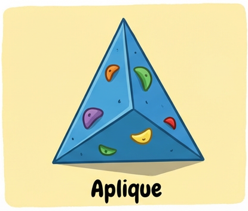

JUEGO DE ESCALADA PARA INFANTILES

Se trata de un juego de prendas en el que participan dos equipos, el equipo A y el equipo B. Cada equipo debe completar la prenda en el menor tiempo posible. En pantalla, se van a ir mostrando los puntos y los tiempos, que cada equipo va realizando al completar las prendas.-

En pantalla va a desplegarse una cuadrícula con nueve cuadrados.

Al tocar un cuadrado, se va a mostrar el nombre de una toma que el equipo debe tocar, identificar o incluso ser un top de vía en la palestra.

Estas tomas pueden ser:

Aplique	
Bidedo	
Lateral	
Regleta	
Roma	
Comodín(el equipo elige que toma quiere)	
El juego consta de dos etapas. La primera, cada prenda es una sola toma, Aplique, Roma, etc. La segunda etapa, combina dos tomas, por lo que hay una mayor complejidad a la hora de realizar el desafío.-
